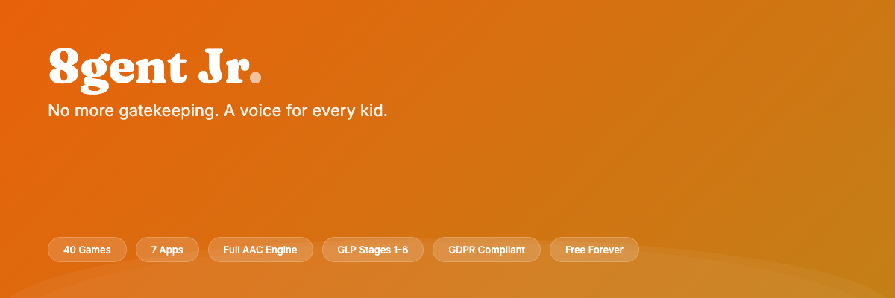

<p align="center">
  
</p>

<p align="center">
  <strong>Personal AI operating systems will replace SaaS.</strong>
</p>

<p align="center">
  <a href="https://8gentjr.com"></a>
  <a href="https://8gentos.com"></a>
  <a href="https://github.com/8gi-foundation/8gent-code"></a>
  <a href="https://8gent.world"></a>
  <a href="https://8gent.games"></a>
</p>

<br />

## The Ecosystem

Six products sharing the Eight kernel, deployed at `eight-vessel.fly.dev` (Amsterdam).

<table>
<tr>
<td width="33%" valign="top">

### 8gent Jr
**[8gentjr.com](https://8gentjr.com)**

AI assistant for children. AAC communication, education, and play. Built by a father for his non-verbal autistic son.

`Free forever`

</td>
<td width="33%" valign="top">

### 8gent OS
**[8gentos.com](https://8gentos.com)**

Personal AI operating system for adults. The revenue engine.

`In development`

</td>
<td width="33%" valign="top">

### 8gent Code
**[GitHub](https://github.com/8gi-foundation/8gent-code)**

Terminal-first coding agent. Open source on-ramp to the ecosystem.

`Open source`

</td>
</tr>
</table>

<br />

> Constitution: [8gent.world/constitution](https://8gent.world/constitution)

---

<br />

## 8gent Jr

<table>
<tr>
<td width="50%" valign="top">

### AAC Engine

- **200+ core words** with 46K ARASAAC symbols
- **GLP stages 1-6** (Marge Blanc NLA framework)
- **Fitzgerald Key** color-coded categories
- **AI sentence engine** -- autocomplete, improvement, encouragement
- **Morphology engine** -- plurals, verb tenses, possessives
- **Motor lock** -- accidental tap prevention
- **Custom card creation** by parents
- **Parent PIN lock** for settings

</td>
<td width="50%" valign="top">

### 40 Educational Games

| Category | Count | Highlights |
|----------|-------|-----------|
| Speech | 8 | AnimalSounds, FeelingsExplorer, RhymeTime |
| Sensory | 4 | BubbleWrap, MarbleRun, ShapeTower |
| Sensory 3D | 10 | BreathingSphere, LavaLamp, Starfield |
| Math | 6 | CountingBalls, NumberBonds, NumberOrder |
| Language | 6 | LetterTrace, MemoryMatch, WordRepeat |
| Patterns | 6 | ColorSort, PatternComplete, SizeSort |

</td>
</tr>
</table>

<table>
<tr>
<td width="33%" valign="top">

### 7 Standalone Apps

- **AAC Board** -- core communication
- **Draw** -- full-screen canvas
- **Music** -- DrumPads + Xylophone
- **Timer** -- visual regulation tool
- **VSD** -- Visual Scene Display
- **Speech Therapy** -- guided practice
- **Intuition** -- decision game

</td>
<td width="33%" valign="top">

### SchoolTube

YouTube Kids-style educational content launcher with:
- Reels feed with swipe navigation
- Video player with parental controls
- Weekly activity schedule
- Daily activity suggestions
- Category filtering

</td>
<td width="33%" valign="top">

### Therapist Tools

- **SLT reports** with CSV export
- **Vocabulary growth** tracking
- **GLP stage progression** monitoring
- **Session analytics** capture
- **Music therapy** playlists
- **GDPR compliant** data handling

</td>
</tr>
</table>

<br />

<details>
<summary><strong>GDPR Compliance</strong></summary>
<br />

| Requirement | Implementation |
|-------------|---------------|
| Consent gate | Server + client enforcement before any data processing |
| Data retention | 90-day auto-purge cron for sentenceHistory |
| Right to erasure | Article 17 deletion via admin panel |
| Data portability | Article 20 JSON export |
| Breach procedure | 72h DPC notification, documented in `/docs/BREACH-NOTIFICATION-PROCEDURE.md` |
| DPIA | Full assessment in `/docs/DPIA.md` |
| Age of consent | Ireland: 16 (Data Protection Act 2018, Section 31) |

</details>

---

<br />

## Tech Stack

| Layer | Jr `packages/jnr/` | OS `web/` | Mobile `mobile/` |
|:------|:-------------------:|:---------:|:----------------:|
| **Framework** | Next.js 14 | Next.js 16 | Expo SDK 54 |
| **UI** | React + Tailwind | React 19 + Tailwind | React Native + Reanimated |
| **Backend** | Convex | Convex | Convex |
| **Auth** | Clerk | Clerk | Clerk |
| **AI (chat)** | Groq (Llama 3.1) | OpenAI / OpenRouter | Claude (AI SDK) |
| **AI (vision)** | Claude Sonnet (layout analysis) | -- | -- |
| **AI (music)** | Suno (song generation) | -- | -- |
| **TTS** | ElevenLabs + Web Speech | ElevenLabs | -- |
| **Daemon** | eight-vessel (Fly.io) | eight-vessel (Fly.io) | -- |
| **Deploy** | Vercel | Vercel | EAS |

<br />

## Domain Routing

```
8gent.app          Sign-in gateway (Clerk auth)
8gentjr.com        Jr landing page
nick.8gentjr.com   Nick's personal 8gent (subdomain per child)
8gentos.com        OS product (in development)
8gent.world        Ecosystem hub
8gent.games        Gaming experiences
```

---

<br />

## Quick Start

```bash
# Install
pnpm install

# 8gent Jr
cd packages/jnr && pnpm dev

# Convex backend
npx convex dev

# Web (OS)
cd web && pnpm dev

# Mobile
cd mobile && pnpm dev
```

<details>
<summary><strong>Environment Variables</strong></summary>
<br />

```env
# Core
CONVEX_DEPLOYMENT=
NEXT_PUBLIC_CONVEX_URL=
NEXT_PUBLIC_CLERK_PUBLISHABLE_KEY=
CLERK_SECRET_KEY=

# AI Services
GROQ_API_KEY=              # Primary LLM (Llama 3.1, free tier)
ANTHROPIC_API_KEY=         # Vision/layout analysis (Claude Sonnet)
OPENAI_API_KEY=            # Fallback LLM
ELEVENLABS_API_KEY=        # Text-to-speech + voice cloning
REPLICATE_API_KEY=         # Image generation
FAL_API_KEY=               # Fast image generation

# Daemon
NEXT_PUBLIC_DAEMON_URL=    # wss://eight-vessel.fly.dev
NEXT_PUBLIC_DAEMON_AUTH_TOKEN=
```

</details>

<details>
<summary><strong>Monorepo Structure</strong></summary>
<br />

```
8gent/
  packages/jnr/     8gent Jr (Next.js 14, AAC/education)
  mobile/            Expo React Native (iOS/Android)
  web/               Next.js web app (8gent OS)
  convex/            Shared Convex backend
  docs/              DPIA, breach procedure, funding
```

</details>

---

<br />

<p align="center">
  <a href="./BRAND.md">Brand</a> &middot;
  <a href="https://8gent.world/constitution">Constitution</a> &middot;
  <a href="./docs/DPIA.md">DPIA</a> &middot;
  <a href="./docs/BREACH-NOTIFICATION-PROCEDURE.md">Breach Procedure</a> &middot;
  <a href="./SPONSORS.md">Sponsor</a>
</p>

<p align="center">
  <sub>Built in Ireland. Every child deserves a voice.</sub>
</p>
